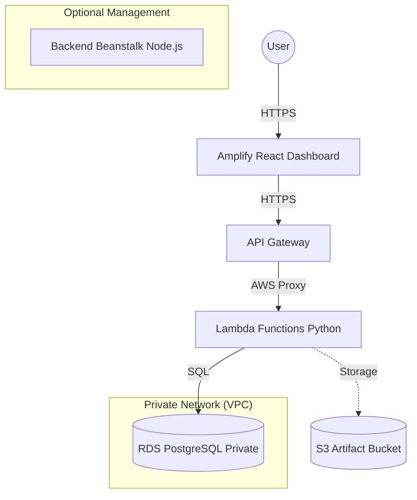

# 🚀 AWS Full-Stack Architecture — Dashboard Master Guide

Repository ini berisi arsitektur Full-Stack modern yang siap menampung ribuan request dengan skalabilitas tinggi, keamanan terjamin, dan otomatisasi CI/CD penuh menggunakan CloudFormation.

> [!IMPORTANT]
> **Tujuan:** Anda cukup melakukan `git clone`, mengisi *Secrets* di GitHub, dan semuanya akan ter-deploy secara otomatis.

---

## 📊 Arsitektur Sistem



### 📁 Teknologi yang Digunakan
*   **Web Console:** React & Vite (Hosted on AWS Amplify)
*   **Backend Serverless:** Python 3.12 (AWS Lambda)
*   **API Layer:** REST API (AWS API Gateway)
*   **Database:** PostgreSQL (AWS RDS Free Tier)
*   **Infrastructure:** CloudFormation (IaC)
*   **CI/CD:** GitHub Actions

---

## 🚀 Multi-Project & Multi-User Support

Sistem ini mendukung deployment banyak instance (misal: production, staging, atau dev per developer) dalam **satu akun AWS yang sama** tanpa bentrok.

### Cara Mengubah Nama Project
Secara default, prefix resource adalah `myapp`. Jika Anda ingin menggunakan nama lain (misal: `alfi-project`):

1.  Buka **GitHub Repository** Anda.
2.  Pergi ke **Settings** > **Secrets and variables** > **Actions**.
3.  Klik tab **Variables**.
4.  Klik **New repository variable**.
5.  Isi Name: `PROJECT_PREFIX` dan Value: `nama-anda` (misal: `alfi`).
6.  Trigger ulang workflow deployment.

Semua resource (VPC, RDS, S3, dll) akan dibuat dengan prefix tersebut, sehingga tidak akan menabrak infrastruktur orang lain.

---

## 🛠️ Langkah Deployment (Clone & Run)

### 1. Persiapan Akun AWS
Pastikan Anda memiliki User IAM dengan akses `AdministratorAccess` (untuk mempermudah testing) dan ambil **Access Key ID** serta **Secret Access Key**.

### 2. Konfigurasi GitHub Secrets & Variables
Buka Repository Anda di GitHub dan tambahkan data berikut:

| Type | Name | Value (Contoh) | Deskripsi |
| :--- | :--- | :--- | :--- |
| **Secret** | `AWS_ACCESS_KEY_ID` | `AKIA...` | Key ID AWS Anda |
| **Secret** | `AWS_SECRET_ACCESS_KEY` | `wJalr...` | Secret Key AWS Anda |
| **Secret** | `AWS_ACCOUNT_ID` | `123456789012` | ID Akun AWS (12 digit) |
| **Secret** | `DB_PASSWORD` | `PasswordAman123` | Password untuk RDS PostgreSQL |
| **Variable** | `PROJECT_PREFIX` | `my-unique-app` | Prefix nama resource (opsional) |

### 3. Deploy Infrastruktur
Push ke branch `main` atau jalankan manual di tab **Actions**:
1. Pilih workflow **🏗️ Deploy Infrastructure**.
2. Klik **Run workflow**.
3. Tunggu hingga selesai (~15-20 menit).

### 4. Deploy Backend & Lambda
Setelah infrastruktur selesai, jalankan workflow:
- **🖥️ Deploy Backend**: Untuk update API di Elastic Beanstalk.
- **⚡ Deploy Lambda**: Untuk update logic serverless.

### 5. Konfigurasi Frontend
1. Ambil `APIEndpoint` dari output workflow **Deploy Infrastructure**.
2. Tambahkan ke GitHub Secrets: `VITE_API_URL`.
3. Deploy frontend via AWS Amplify Console (lihat panduan di bawah).

---

## 🧪 Cara Testing Lokal & Smoke Test
Setelah semua LIVE, Anda bisa menguji API Gateway secara langsung:

```bash
# Ganti URL dengan API Gateway URL Anda
API_URL="https://abcde123.execute-api.ap-southeast-1.amazonaws.com/v1"

# Simpan Data
curl -X POST "$API_URL/data" -H "Content-Type: application/json" -d '{"name":"tes-sensor","value":25.5,"category":"Test"}'

# Ambil Data
curl "$API_URL/data"
```

---

## 🛡️ Keamanan & Performa
*   **Keamanan:** Database RDS berada di **Private Subnet**, hanya bisa diakses oleh Lambda & Beanstalk.
*   **CORS Robustness:** Sudah dilengkapi `Gateway Responses` sehingga error 4xx/5xx tetap bisa terbaca oleh browser (tidak "Failed to fetch").
*   **Auto-Scaling:** API Gateway & Lambda menangani ribuan request secara otomatis tanpa perlu manajemen server.

---

## 🗑️ Menghapus Semua Resource (Destroy)
Jangan biarkan bill membengkak jika tidak digunakan!
1. Buka tab **Actions** di GitHub.
2. Jalankan workflow **"🗑️ Destroy Infrastructure"**.
3. Ketikkan **`DESTROY`** untuk konfirmasi. Semua resource akan dihapus bersih.

---
*Dibuat dengan ❤️ oleh Antigravity untuk arsitektur AWS yang lebih baik.*
